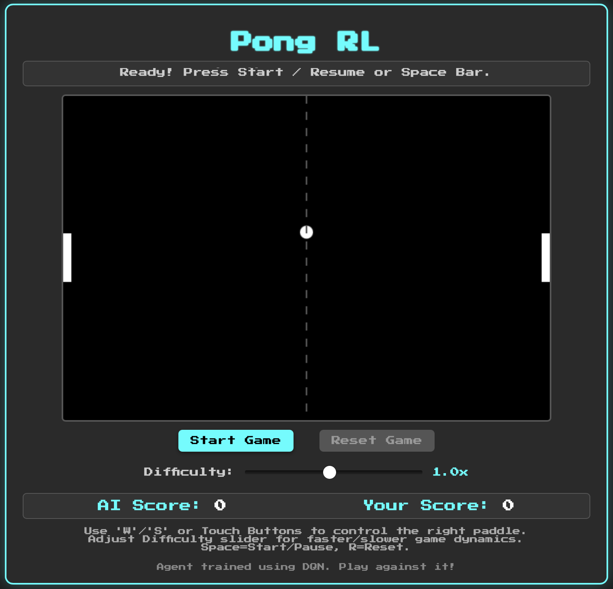

# Pong RL — Player vs AI Demo 🎮🤖

This is a browser-based Pong game where you can play against an AI trained with reinforcement learning (DQN). The AI has been converted to run client-side using ONNX and JavaScript, so everything runs directly in your browser with no backend!



---

## 🧠 How the Agent Was Trained

* **Algorithm:** Deep Q-Network (DQN)
* **Environment:** Custom-built Pong environment (not Gym) with 5D state (excluding opponent paddle) and faster dynamics.
* **Opponent (Training):** A deterministic, rule-based paddle with matching speed.
* **Goal:** Train until the agent achieves a high win rate against the deterministic opponent in the faster environment.
* **Export:** Model converted to ONNX for use in browser (see `source/convert_model.py`).

Training scripts and supporting files:

* `source/train_pong.py`: Training loop (configured for 5D state)
* `source/dqn_agent.py`: Agent logic
* `source/pong_env.py`: Custom environment
* `source/model.py`: PyTorch DQN model
* `source/replay_buffer.py`: Experience replay implementation
* `pong.pth`: Fully trained Pong RL Agent

---

## 🎮 How to Play

* **Start/Pause/Resume:** Press the **Space Bar** or click the "Start / Resume" button.
* **Move Your Paddle (Right):** Use the **`W`** (Up) and **`S`** (Down) keys, or the **Touch Buttons** on mobile devices.
* **Adjust Difficulty:** Use the **Difficulty slider** to change the game speed (affects ball and paddle speeds). Can only be adjusted when the game is paused or before starting.
* **Reset Game:** Press the **`R`** key or click the "Reset Game" button to reset scores and positions.
* **Goal:** Try to score points against the AI agent controlling the left paddle! The game continues automatically after each point.

---

## 🛠️ Tech Stack

### 🕹️ Frontend (docs/)

* **HTML, CSS, JavaScript** — Interactive game UI
* **Model Runtime:** [ONNX Runtime Web](https://www.npmjs.com/package/onnxruntime-web)
* **Font:** [Press Start 2P](https://fonts.google.com/specimen/Press+Start+2P)
* **Model Inference:** `agent.js` uses ONNX to infer paddle movement in real time

### 🧠 Training (source/)

* **Framework:** PyTorch
* **RL Algorithm:** Deep Q-Network (DQN) with target network and replay buffer
* **Model Export:** Python-to-ONNX conversion using `torch.onnx.export`
* **Testing Tools:** `play.py` using `pygame` for visual evaluation of RL Agent

---

## 🌐 Try It Out

👉 [Play Now on GitHub Pages](https://oystebw.github.io/pong-rl-game/)

---

## 📦 Setup Locally

### 1. Clone the Repository

```bash
git clone https://github.com/oystebw/pong-rl-game.git
cd pong-rl-game
```

### 2. Set Up Python Environment

```bash
python3.10 -m venv venv
source venv/bin/activate
pip3 install -r requirements.txt
```

> ⚠️ **Note:** If you encounter errors during setup, make sure you're using **Python 3.10**.
> You can install it via [pyenv](https://github.com/pyenv/pyenv), [Homebrew](https://brew.sh), or your system package manager.

### 3. Launch Browser Game

```bash
cd docs
python3 -m http.server 8000
# Then open http://localhost:8000 in your browser
```

### 4. Train a New Agent (Optional)

```bash
cd source
# Ensure pong_env.py has desired speeds/state settings
python3 train_pong.py # See file for tunable parameters
```

### 4.1. Convert the New Agent to ONNX and Integrate with Frontend (Optional)

```bash
# Make sure convert_model.py points to the correct .pth file and has correct STATE_DIM
python3 convert_model.py
cd ..
# Ensure the output ONNX file name matches the one loaded in agent.js
mv source/dqn_pong_agent.onnx docs/dqn_pong_agent.onnx
```

### 5. Visualize Agent Performance (Optional)

```bash
cd source
# Ensure play_pong.py points to the correct .pth file and hidden_dim
python3 play_pong.py
```